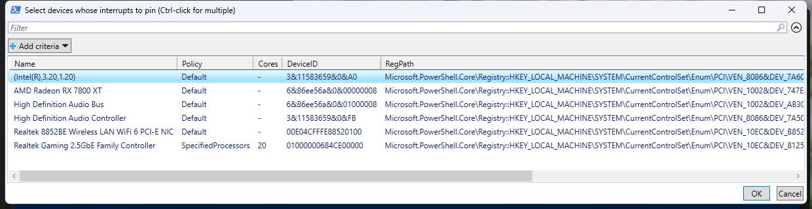
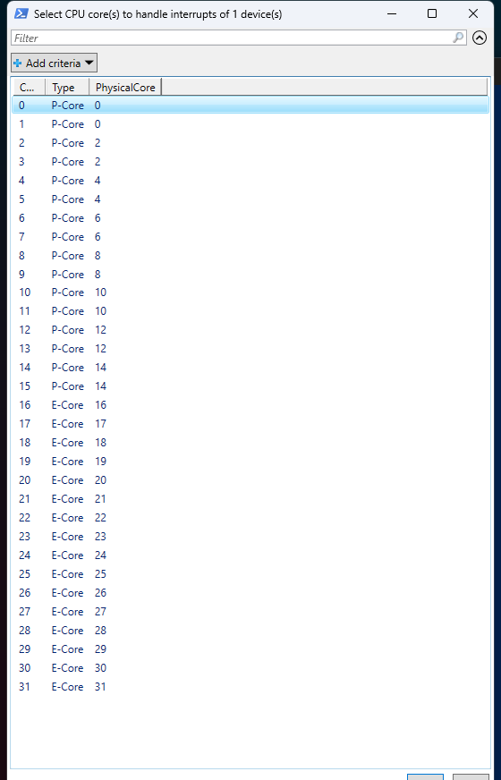

<div align="center">

# Interrupt Affinity Utility

**Pin device interrupts to specific CPU cores. Tame DPC latency. P/E-core aware.**

An open-source PowerShell script to view and set the **interrupt affinity policy** of PCI devices on Windows 10/11 — a transparent alternative to GoInterruptPolicy and the retired Microsoft Interrupt-Affinity Policy Tool.
Zero install. Zero dependencies. Built-in undo.

[](https://github.com/vadyaravadim/interrupt-affinity-utility/actions/workflows/lint.yml)
[](LICENSE)
[](https://www.microsoft.com/windows)
[](https://docs.microsoft.com/en-us/powershell/)
[](https://github.com/vadyaravadim/interrupt-affinity-utility/releases)
[](https://www.powershellgallery.com/packages/interrupt-affinity-utility)


</div>

---





## Quick Start

**Easiest — from the PowerShell Gallery:**

```powershell
Install-Script interrupt-affinity-utility
interrupt-affinity-utility           # then run it by name (open a NEW PowerShell window first, so the Scripts folder is on PATH)
interrupt-affinity-utility -ShowAll  # switches work directly: -ShowAll, -Reset
```

The script self-elevates. Update later with `Update-Script interrupt-affinity-utility`.

**One-liner** instead (in any PowerShell — it self-elevates):

```powershell
irm https://raw.githubusercontent.com/vadyaravadim/interrupt-affinity-utility/main/interrupt-affinity-utility.ps1 | iex
```

The script downloads itself to `%USERPROFILE%\interrupt-affinity-utility.ps1` (not a temp folder) on purpose: the `affinity_undo_*.reg` rollback files are written next to it and must survive automatic temp cleanup. An existing copy at that path that differs is kept as `.bak`.

**Or clone:**

```powershell
git clone https://github.com/vadyaravadim/interrupt-affinity-utility.git
cd interrupt-affinity-utility
.\Run.bat
```

**Or download the ZIP** (no PowerShell needed): click **Code ▸ Download ZIP** at the top of this page, unzip, then double-click **`Run.bat`**.

### Using the picker

However you launch it:

1. Click **Yes** on the UAC prompt (the script requests admin rights on its own).
2. In the first grid, `Ctrl`-click the devices you want, then click **OK**.
3. In the second grid, `Ctrl`-click the CPU core(s) that should service their interrupts, then click **OK**.
4. **Restart the device** (disable/enable in Device Manager) or reboot.

### Optional switches

| Switch | Effect |
| --- | --- |
| `-ShowAll` | Show every PCI device with interrupt settings, including bridges/controllers hidden by default |
| `-Reset` | Remove the affinity override from the selected devices (restore the machine default) |

## What It Does

1. **Scans** PCI devices and shows the latency-critical ones (GPU, network, USB, audio) in a grid with their current affinity policy and assigned cores
2. **Lets you pick cores** in a second grid — on hybrid CPUs (Intel 12th gen+) every logical CPU is labeled **P-Core** or **E-Core**, and HT/SMT siblings are visible via the physical core column
3. **Backs up** the previous state of every selected device to a timestamped `affinity_undo_*.reg` file next to the script — **before** changing anything — and records each device's very first pre-tool state in a cumulative `affinity_undo_original.reg`
4. **Pins the interrupts** by writing the documented `DevicePolicy` / `AssignmentSetOverride` registry values

Rollback = double-click the undo file, then restart the device or reboot. No System Restore needed — works from Safe Mode too.

## The Problem: Who Services Your Interrupts?

Every time your GPU finishes a frame or your NIC receives a packet, it raises an interrupt, and some CPU core stops what it's doing to service it (the ISR), then runs the follow-up work (the DPC). By default Windows decides which cores that happens on — and its choice can collide with whatever those cores are already busy with. On hybrid CPUs the interrupts of a latency-critical device can even land on slower E-cores.

An **affinity policy** tells Windows which cores are allowed to service a given device's interrupts. Pinning a latency-critical device (GPU, NIC, audio, USB) to one or two dedicated P-cores — away from CPU 0, where much of the system's own interrupt traffic lands — is a classic tweak for:

- DPC latency spikes and frame-time stutters despite high FPS
- Audio popping / crackling under load
- Inconsistent input response in competitive games

It is also the standard server-side technique for network scaling — Microsoft shipped a dedicated tool for exactly this in the Windows Server era (see [FAQ](#how-is-this-different-from-the-microsoft-interrupt-affinity-policy-tool-intpolicy)).

## Requirements

| | |
|---|---|
| **Windows** | 10, 11 (64-bit, up to 64 logical processors) |
| **PowerShell** | Windows PowerShell 5.1 (ships with Windows 10/11). Uses `Out-GridView` — built into Windows PowerShell 5.1; PowerShell 7 needs the `Microsoft.PowerShell.GraphicalTools` module; **not** available on Server Core. The script detects a missing `Out-GridView` and tells you what to do |
| **Rights** | Administrator (the script self-elevates via UAC) |

## How It Works

The affinity policy lives right next to the MSI settings, in the [documented](https://learn.microsoft.com/windows-hardware/drivers/kernel/interrupt-affinity-and-priority) registry key:

```
HKLM\SYSTEM\CurrentControlSet\Enum\PCI\<device>\<instance>\Device Parameters\Interrupt Management\Affinity Policy
    DevicePolicy           (DWORD)     which policy to use
    AssignmentSetOverride  (BINARY)    KAFFINITY bitmask: bit N = logical CPU N (little endian)
```

`DevicePolicy` values ([IRQ_DEVICE_POLICY](https://learn.microsoft.com/windows-hardware/drivers/ddi/wdm/ne-wdm-_irq_device_policy)):

| Value | Policy | Meaning |
| --- | --- | --- |
| absent / 0 | MachineDefault | Windows decides (the default) |
| 1 | AllCloseProcessors | Processors close to the device (NUMA) |
| 2 | OneCloseProcessor | One processor close to the device |
| 3 | AllProcessors | Any processor |
| 4 | **SpecifiedProcessors** | **Only the processors in `AssignmentSetOverride`** — what this script sets |
| 5 | SpreadMessages | Spread MSI-X messages across processors |
| 6 | Steered (system) | Windows interrupt steering manages the processors dynamically — set by the system, not by tools |

The script writes `DevicePolicy = 4` plus your core mask, and shows the current policy of every device in the grid — so a policy set earlier (by this script, GoInterruptPolicy, or a driver INF) is always visible before you change it.

P/E-core labels come from the `GetSystemCpuSetInformation` Windows API (the `EfficiencyClass` field) — the same source the Windows scheduler uses, not a clock-speed guess.

The new policy is read when the device's driver starts, so it takes effect after a device restart (disable/enable in Device Manager) or a reboot.

## Verify: Watch the Interrupts Move

After restarting the device, put it under load (for a NIC: download something; for a GPU: run a game) and watch where its interrupts are serviced:

- For NICs there is a per-device, per-CPU counter set — in PowerShell under load:

  ```powershell
  Get-CimInstance Win32_PerfFormattedData_Counters_PerProcessorNetworkInterfaceCardActivity |
      Where-Object { $_.InterruptsPersec -gt 0 } | Select-Object Name, InterruptsPersec
  ```

  The `Name` column is `<cpu>, <adapter>` — the CPU number switches to the core you pinned.
- **perfmon** → **Per Processor Network Interface Card Activity ▸ Interrupts/sec** shows the same thing graphically; for non-NIC devices use a trace (`xperf -a dpcisr`) or LatencyMon's per-CPU view.
- Or run the script again — the grid shows the current policy and core list of every device.

This exact check is how the utility was validated on a Realtek 2.5GbE NIC (i9-14900F): with the default policy its ISR ran on CPU 1; pinned to CPU 10 it moved to CPU 10 (~6600 interrupts/sec under a saturated download), pinned to CPU 20 it moved to CPU 20, and applying the undo files put it back on CPU 1. The receive DPCs kept landing on the RSS-owned CPUs throughout — see the [RSS FAQ](#why-dont-my-cores-change-anything-for-my-nic).

## Reverting

Three options:

1. Double-click the timestamped `affinity_undo_*.reg` file created before your change, then restart the device or reboot (restores the state before *that* run — including a policy written by another tool — and works from Safe Mode).
2. Double-click `affinity_undo_original.reg` — a cumulative snapshot of the state each device had before this script *first* touched it, no matter how many runs happened since.
3. Run the script again with `-Reset` and select the same devices — this deletes `DevicePolicy` and `AssignmentSetOverride`, returning the device to the machine default. Note: if another tool had set a policy you want back, only the undo files restore it.

Prefer a System Restore point anyway? Create one yourself before running: `Checkpoint-Computer -Description "Before affinity"` (note: Windows silently skips it if a point was made within the last 24 hours).

## FAQ

### What is interrupt affinity (IRQ affinity)?

The set of CPU cores allowed to service a device's interrupts — both the interrupt service routine (ISR) and the deferred procedure calls (DPCs) that follow it. Windows computes it from the device's *affinity policy*; this script sets that policy per device.

### Does pinning interrupts reduce input lag or increase FPS?

It targets **consistency**, not average FPS: keeping a latency-critical device's interrupts on dedicated, lightly-loaded P-cores reduces the chance that an ISR/DPC gets delayed behind other work — which is what shows up as frame-time spikes, audio crackle, or inconsistent input response. On a healthy system with no DPC latency problem you may see no difference at all. Measure before and after (e.g. with LatencyMon or perfmon) instead of stacking tweaks blindly.

### Which cores should I pick on a hybrid CPU (P-cores vs E-cores)?

For latency-critical devices: **P-cores**, and conventionally not CPU 0 (a lot of system interrupt traffic already lands there). On CPUs with Hyper-Threading, the two logical CPUs sharing one physical core are visible in the grid via the **PhysicalCore** column — picking one logical CPU per physical core avoids sharing the core with its busy sibling. A common choice is one or two P-cores that your game threads don't saturate.

### Is it safe?

`DevicePolicy` and `AssignmentSetOverride` are documented, reversible registry values. Before every change the script saves a `.reg` undo file with the previous state of the values it changes. Worst case, a device that misbehaves with a restrictive mask reverts as soon as you apply the undo file and restart it (works from Safe Mode too). One real footgun to avoid: don't pin *everything* to the same single core — you'd recreate the very contention you're trying to remove.

### How is this different from GoInterruptPolicy?

[GoInterruptPolicy](https://github.com/spddl/GoInterruptPolicy) is a solid GUI tool, but it ships as a compiled `.exe` — you run a binary and trust the build. This is a ~400-line PowerShell script you can read top to bottom before running, it filters the list down to latency-critical devices, labels P/E-cores on hybrid CPUs, and writes a `.reg` undo file before every change. It deliberately does *less*: no `DevicePriority`, no MSI toggles (that's [MSI Mode Utility](https://github.com/vadyaravadim/msi-mode-utility)'s job), no message-limit editing. Use whichever you prefer — this is the transparent, scriptable option.

### How is this different from the Microsoft Interrupt-Affinity Policy Tool (IntPolicy)?

IntPolicy was Microsoft's own GUI for exactly these registry values, distributed via the old WHDC site for Windows Server tuning — it's long retired and hard to find a trustworthy copy of. This script sets the same documented values, adds the undo file, and knows about P/E-cores, which didn't exist in IntPolicy's era.

### Why don't my cores change anything for my NIC?

Three usual reasons: (1) the device wasn't restarted — the policy is read at driver start; (2) the policy shows `Default` again — some driver updates recreate the key; (3) for NICs specifically, **RSS** (Receive Side Scaling) distributes receive processing across its own set of CPUs. Interrupt affinity and RSS interact: if you want to steer RSS itself, use `Set-NetAdapterRss -BaseProcessorNumber/-MaxProcessors` — the interrupt affinity policy is the right tool for pinning the interrupt itself, not for reshaping RSS spreading.

### Should I combine this with MSI mode?

They're complementary: [MSI Mode Utility](https://github.com/vadyaravadim/msi-mode-utility) switches *how* a device delivers interrupts (message-signaled instead of shared lines); this utility controls *where* they're serviced. The registry keys literally sit next to each other. Typical order: enable MSI first, then pin affinity if you still see DPC latency spikes.

### What about DevicePriority?

The same registry key also accepts a `DevicePriority` value (interrupt priority). This script doesn't touch it: raising priorities rarely helps and makes latency problems harder to reason about. Because the undo file is value-level, a `DevicePriority` set by another tool survives both this script's changes and its undo.

### Where are my NVMe drives?

Hidden by the default filter on purpose: NVMe already spreads MSI-X interrupts across cores out of the box, and pinning them usually hurts. Use `-ShowAll` if you want to see them anyway.

## Related

- [MSI Mode Utility](https://github.com/vadyaravadim/msi-mode-utility) — enable MSI mode (Message Signaled Interrupts) for GPU, USB, network & audio devices to cut DPC latency and input lag
- [CPU Parking Disabler](https://github.com/vadyaravadim/cpu-parking-disabler) — disable CPU core parking on Windows 10/11 to fix micro-stutters and input lag
- [Timer Resolution Utility](https://github.com/vadyaravadim/timer-resolution-utility) — set 0.5 ms timer resolution, disable dynamic tick, un-force HPET — with a built-in Sleep(1) benchmark
- [GameDVR & FSO Disabler](https://github.com/vadyaravadim/gamedvr-fso-disabler) — disable Game DVR / Xbox Game Bar capture and Fullscreen Optimizations on Windows 10/11 to fix capture stutters and frame drops
- [Remove Hidden Devices](https://github.com/vadyaravadim/remove-hidden-devices) — remove ghost / hidden devices left behind by unplugged USB sticks, headsets & dongles cluttering Device Manager

Same idea across the series: one transparent PowerShell script, no binaries, you see exactly what changes.

## Disclaimer

Editing interrupt settings can, in rare cases, cause a device to fail to start. A reboot and reverting the value fixes it. Use at your own risk.

## License

[MIT](LICENSE) — use at your own risk.

---

<div align="center">

If this fixed your stutters, consider giving it a ⭐

[Report Issues](https://github.com/vadyaravadim/interrupt-affinity-utility/issues)

</div>
